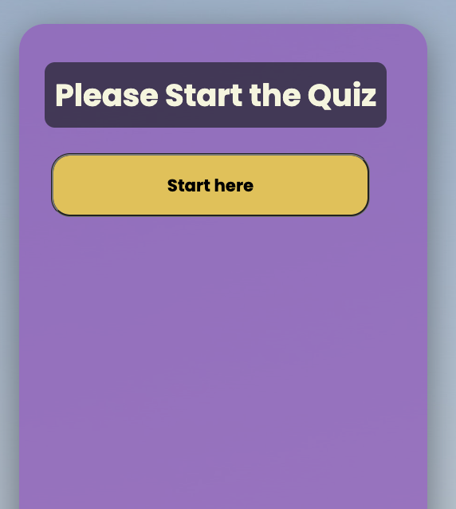
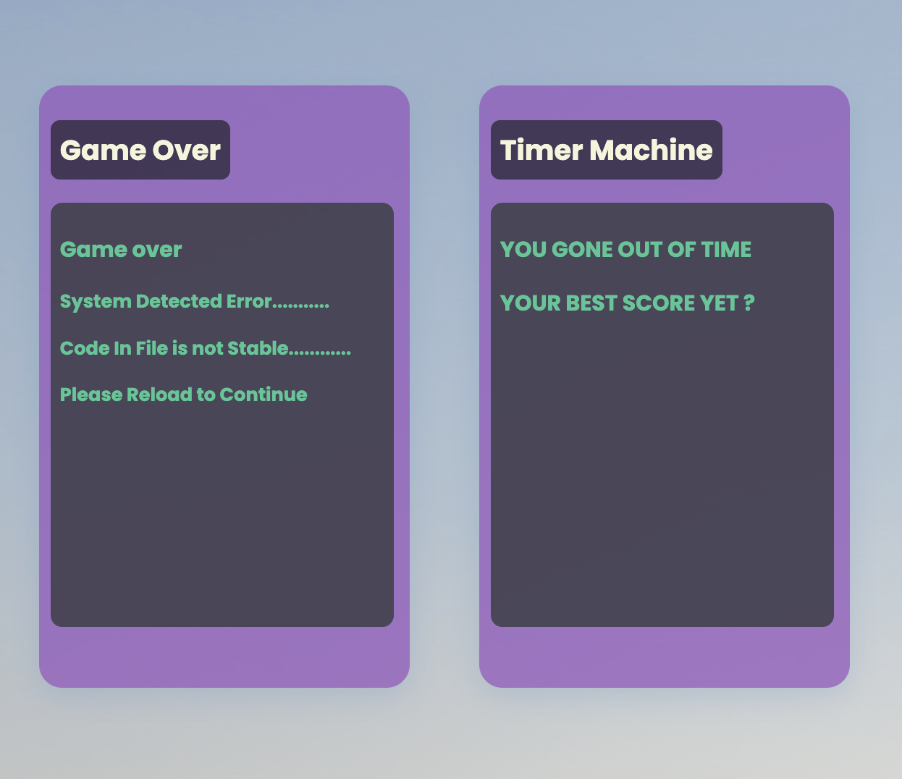
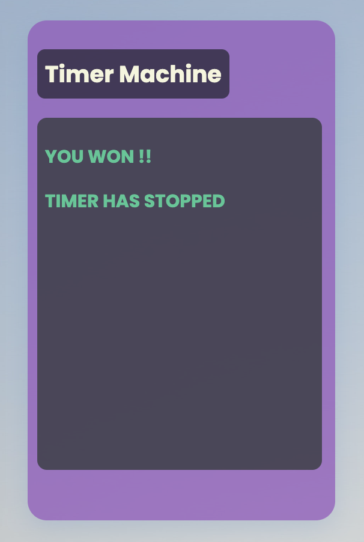
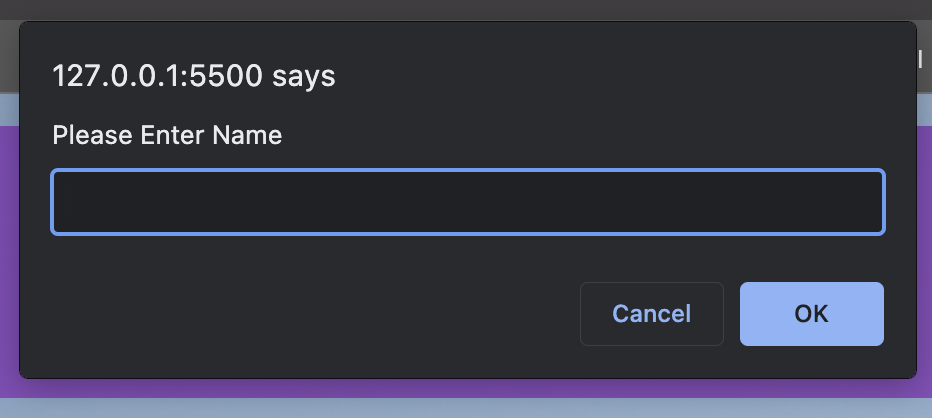

# Web APIs Challenge: Code Quiz

## DESCRIPTION 
Website design to do timer quizzes and save user information in client-side for later access.

---

#### INSTALLATION 
* Download the Zip file to your device
* Open file to zip local as needed
* Use your IDE to make updates accordingly
* Update your repository and use it accordingly

----

#### USAGE 
* Open the webpage user should see a beautiful and responsive webpage with HTML elements and CSS stylings.
* Then the user will click on the start button to begin the game
* The User will be asked to enter the answer only in number for each question.
* After game is over user will be ask if they want to save their name and score.
* Once the user makes a selection, username and score will be saved to local storage.
* User will see name display on screen.

#### USER INTERFACE

**Home Screen**

**Start The Game**

**Answer Validation**

**User Score Save**

------

### Development Process

Throughout this project I learned that using comment on js or HTML is very useful when it come to project this complexity. I have only been coding for 2 weeks and I have grown from this project with all the walls that I ran into. Doing pseudo code really with what is the next step to solve the problem.

Pseudo code:
1. Have a button, when clicked ->
    * Game start
        * Display question
            if the answer is correct move to next question
            else subtract the clock by # of time
        * After answer the question another question appears
    * Timer Start
        * When the timer reach 0
            * if all question is answer == win 
            * else == game is over
2. When the game is over
    * I can save my initial + score:

This is a Mock Up if This Project

---

### Credit

This Website is made available by © Jay's Studio 
